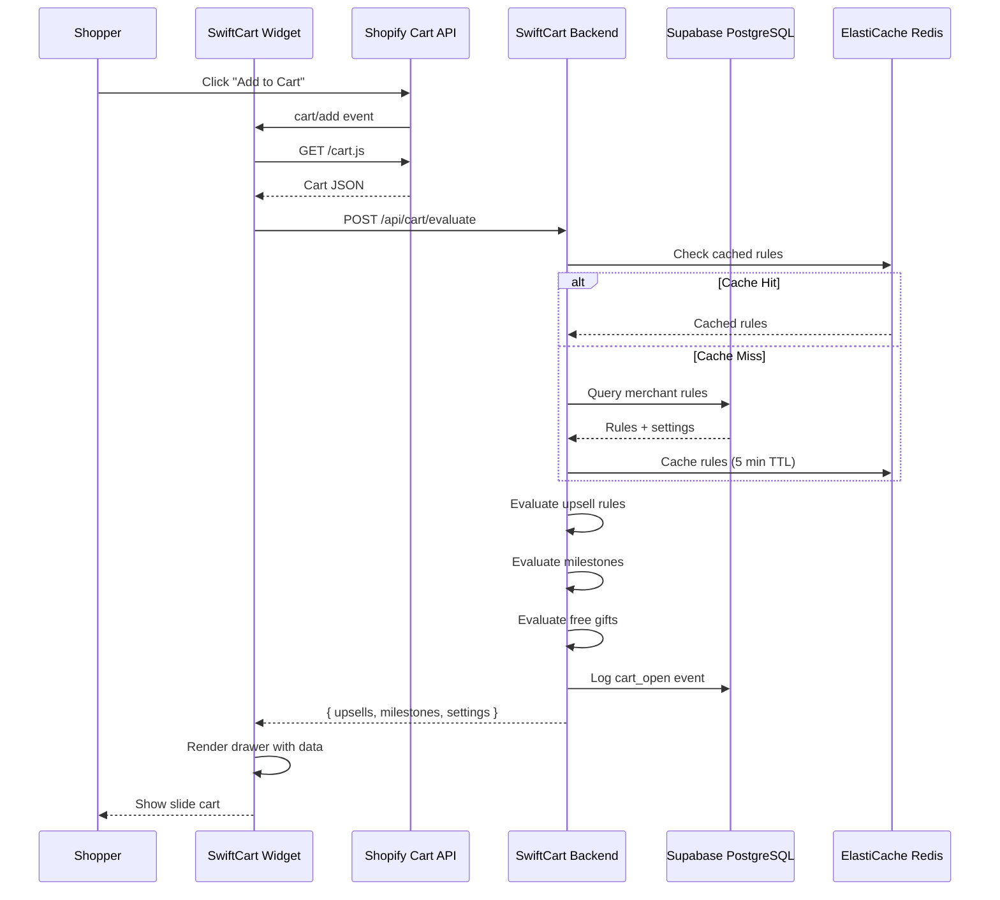
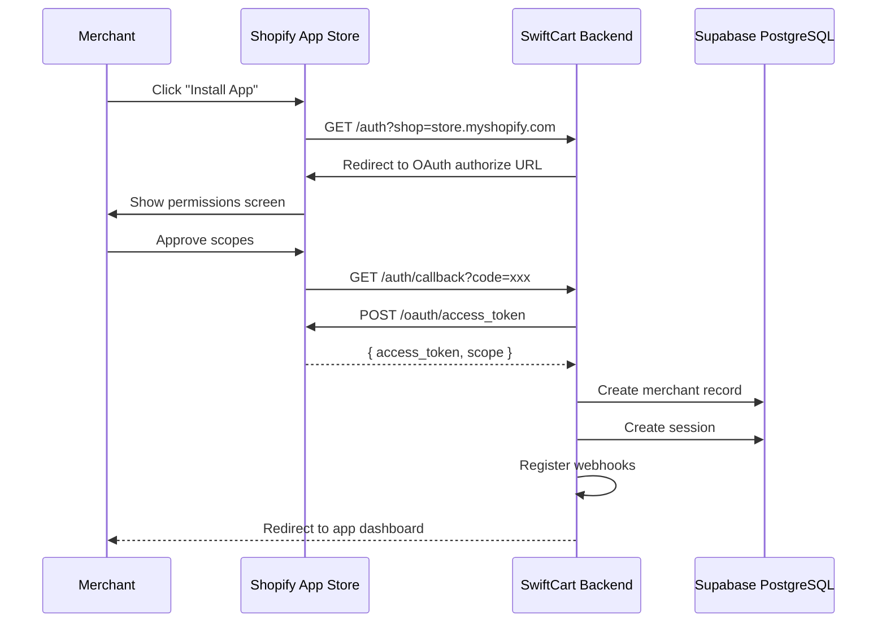
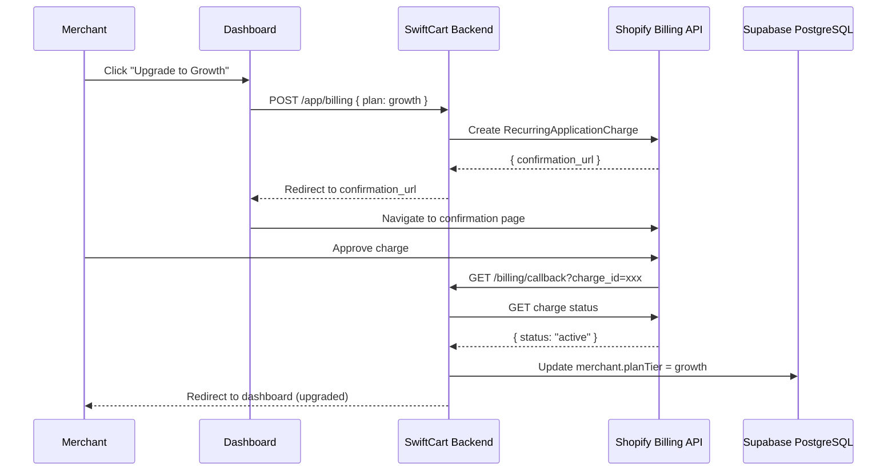
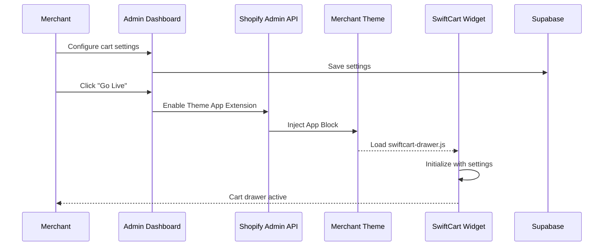

# SwiftCart — Production-Ready Implementation Plan
## Supabase-Focused Architecture

**Version:** 1.0  
**Date:** July 2026  
**Status:** Implementation-Ready  
**Target:** 2 Full-Stack Engineers + Freelancers (10-Week MVP)

---

# SECTION 1: Executive Implementation Summary

## 1.1 Vision

Transform SwiftCart PRD into a **production-ready Shopify App** that delivers:
- Slide cart drawer with AOV boosters for Indian D2C brands
- 40% cheaper than GoKwik Cart (₹999–₹9,999/month in INR)
- Setup time < 10 minutes, no developer required
- Built on **Supabase PostgreSQL** with enterprise-grade RLS

## 1.2 Goals

| Goal | Metric | Target |
|------|--------|--------|
| Merchant Acquisition | 12 months | 500 paying merchants |
| Revenue | ARR | ₹1.25 Cr (₹10L+ MRR) |
| Rating | App Store | 4.5+ stars |
| Performance | Cart render P95 | < 200ms |
| Conversion | Trial → Paid | 35% |

## 1.3 Success Metrics (12-Month)

| KPI | Month 3 | Month 6 | Month 12 |
|-----|---------|---------|----------|
| Paying Merchants | 25 | 150 | 500 |
| MRR (INR) | ₹37,500 | ₹2.5L | ₹10L+ |
| App Store Rating | 4.0+ | 4.3+ | 4.5+ |
| Reviews | 25 | 80 | 200+ |
| Trial → Paid | 25% | 30% | 35% |
| Churn Rate | <8% | <6% | <5% |
| AOV Lift | +8% | +12% | +18% |

## 1.4 MVP Scope (Phase 1 — Weeks 1-10)

### In Scope

| Feature | Priority | Notes |
|---------|----------|-------|
| Shopify OAuth | P0 | Shopify App Bridge v4 |
| Merchant Onboarding | P0 | 5-step wizard |
| Slide Cart Drawer | P0 | Theme App Extension |
| Progress Bar (1 milestone) | P0 | Free shipping unlock |
| Upsell Rules (rule-based) | P0 | 3 trigger types |
| Free Gifts (1 rule) | P0 | Auto-add/remove |
| Coupon Field | P0 | AJAX validation |
| Countdown Timer | P1 | Session-based |
| Sticky ATC (Mobile) | P1 | Product pages only |
| Analytics Dashboard | P1 | Basic metrics |
| Shopify Billing (INR) | P0 | 4 plan tiers |
| Fraud Settings | P2 | Basic pincode blocklist |

### Out of Scope (Phase 2+)

- AI Upsell Recommendations (Phase 2)
- Volume Discounts (Phase 2)
- Multi-milestone Progress Bars (Growth+ plans)
- Shiprocket RTO API Integration (Phase 2)
- Hindi Dashboard Labels (Phase 2)
- WhatsApp Cart Abandonment (Phase 3)
- pgvector Embeddings (Phase 2)
- A/B Testing Framework (Phase 2)

## 1.5 Risks & Mitigations

| Risk | Severity | Probability | Mitigation |
|------|----------|-------------|------------|
| Shopify API Breaking Changes | HIGH | Medium | Pin to 2025-01; E2E test suite |
| Theme Compatibility Issues | HIGH | High | Test top 10 themes pre-launch |
| Low Merchant Conversion | HIGH | Medium | Beta cohort of 10; outreach to network |
| GoKwik Pricing Response | MEDIUM | Low | INR pricing + India-first features |
| Supabase Latency from India | MEDIUM | Low | Use AWS ap-south-1 for app; Supabase regional |
| Data Breach | HIGH | Low | RLS policies; encrypt tokens; no PII logs |
| App Review Rejection | MEDIUM | Medium | Follow guidelines strictly; App Validator CLI |

## 1.6 Go/No-Go Checklist

### Must Have Before Development

- [ ] Shopify Partner Account Created
- [ ] Supabase Project Provisioned (ap-south-1 or closest)
- [ ] Domain: swiftcart.in purchased
- [ ] AWS Account: ap-south-1 configured
- [ ] Team: 2 devs allocated (names confirmed)
- [ ] Beta Merchants: 10 identified from Scalezix network
- [ ] Trademark: "SwiftCart" checked on IP India

### Must Have Before Launch (Week 10)

- [ ] E2E Tests: All core flows passing
- [ ] Theme Compatibility: Top 10 themes tested
- [ ] Lighthouse: <2 point drop on merchant stores
- [ ] Security: Penetration test completed
- [ ] Billing: Shopify Billing API tested in INR
- [ ] Monitoring: Sentry + CloudWatch configured
- [ ] Docs: Help Center + Merchant Onboarding Guide
- [ ] App Store: Listing assets ready

---

# SECTION 2: 10-Week Sprint Plan

## Sprint Overview

| Sprint | Week | Theme | Key Deliverables |
|--------|------|-------|------------------|
| S1 | 1-2 | Foundation | Project scaffold, Supabase, OAuth, Theme Extension |
| S2 | 3-4 | Cart Drawer | Widget: Open/close, items, qty stepper, checkout |
| S3 | 5-6 | AOV Features | Progress bar, countdown, sticky ATC, low stock |
| S4 | 7-8 | Upsell Engine | Rule-based upsells, coupon field, free gifts |
| S5 | 9-10 | Polish & Launch | Dashboard, billing, onboarding, App Store submission |

---

## Sprint 1 (Weeks 1-2): Foundation

### Sprint Goal
Establish production-ready project scaffold with Supabase, Shopify OAuth, and theme extension.

### Tasks

| Category | Task | Owner | Estimate | Dependencies |
|----------|------|-------|----------|--------------|
| **Frontend** | Initialize Remix app with TypeScript | Dev 1 | 4h | — |
| **Frontend** | Configure Vite + React Router | Dev 1 | 2h | — |
| **Frontend** | Setup Polaris + App Bridge | Dev 1 | 3h | Remix scaffold |
| **Frontend** | Create theme extension skeleton | Dev 1 | 4h | — |
| **Backend** | Configure Supabase connection | Dev 2 | 2h | Supabase project |
| **Backend** | Create Prisma schema from Supabase | Dev 2 | 4h | Supabase URL |
| **Backend** | Implement Shopify OAuth flow | Dev 2 | 6h | Prisma schema |
| **Backend** | Setup session storage (Prisma + Supabase) | Dev 2 | 3h | OAuth |
| **Supabase** | Create project in ap-south-1 | Dev 2 | 1h | — |
| **Supabase** | Enable RLS on all tables | Dev 2 | 2h | Schema migration |
| **Supabase** | Configure auth providers | Dev 2 | 1h | — |
| **Shopify** | Create Partner App entry | Dev 1 | 1h | Partner account |
| **Shopify** | Configure scopes (products, orders, etc.) | Dev 1 | 1h | App entry |
| **Shopify** | Create development store | Dev 1 | 1h | — |
| **DevOps** | Setup GitHub repo + branch protection | Lead | 1h | — |
| **DevOps** | Configure CI/CD (GitHub Actions) | Lead | 3h | Repo |
| **DevOps** | Setup Sentry error tracking | Dev 2 | 1h | — |
| **QA** | Write OAuth E2E test (Playwright) | Freelance | 4h | OAuth complete |
| **Docs** | Document environment setup | Dev 1 | 2h | Scaffold |

### Critical Path
```
Supabase Project → Prisma Schema → Shopify OAuth → Session Storage
```

### Deliverables
- [ ] Remix app running locally with Shopify embedded
- [ ] Supabase PostgreSQL connected
- [ ] OAuth flow working (install → auth → session)
- [ ] Theme extension skeleton (`swiftcart-theme-ext`)
- [ ] CI/CD pipeline running tests

---

## Sprint 2 (Weeks 3-4): Cart Drawer Widget

### Sprint Goal
Build fully functional slide cart drawer (vanilla JS, <35KB gzipped).

### Tasks

| Category | Task | Owner | Estimate | Dependencies |
|----------|------|-------|----------|--------------|
| **Frontend** | Build drawer HTML/CSS structure | Dev 1 | 6h | — |
| **Frontend** | Implement open/close animations | Dev 1 | 4h | HTML/CSS |
| **Frontend** | Create cart items list renderer | Dev 1 | 6h | Drawer shell |
| **Frontend** | Build qty stepper component | Dev 1 | 4h | Items list |
| **Frontend** | Implement Shopify Cart API integration | Dev 1 | 6h | — |
| **Frontend** | Create mini cart bubble | Dev 1 | 2h | — |
| **Frontend** | Build order summary section | Dev 1 | 3h | Items list |
| **Backend** | Create `/api/cart/evaluate` endpoint | Dev 2 | 4h | Prisma models |
| **Backend** | Implement cart state validation | Dev 2 | 2h | — |
| **Supabase** | Add index on cart_events.merchant_id | Dev 2 | 1h | — |
| **Shopify** | Test widget on Dawn theme | Dev 1 | 2h | Widget complete |
| **Performance** | Audit bundle size (target <35KB) | Dev 1 | 4h | Widget complete |
| **Performance** | Add lazy loading for cart images | Dev 1 | 2h | Items list |
| **QA** | Test cart operations E2E | Freelance | 4h | Widget complete |
| **QA** | Test on mobile viewports | Freelance | 2h | Widget complete |

### Critical Path
```
Drawer Shell → Cart API Integration → Test on Dawn
```

### Deliverables
- [ ] Slide cart drawer opens/closes smoothly
- [ ] Displays cart items with images, titles, variants
- [ ] Qty stepper updates Shopify cart
- [ ] Remove item functionality
- [ ] Order summary with subtotal
- [ ] Checkout button links to Shopify checkout
- [ ] Bundle size < 35KB gzipped

---

## Sprint 3 (Weeks 5-6): AOV Features

### Sprint Goal
Implement progress bar, countdown timer, sticky ATC, and low stock signals.

### Tasks

| Category | Task | Owner | Estimate | Dependencies |
|----------|------|-------|----------|--------------|
| **Frontend** | Build progress bar component | Dev 1 | 4h | — |
| **Frontend** | Add shimmer animation | Dev 1 | 2h | Progress bar |
| **Frontend** | Implement milestone unlock celebration | Dev 1 | 2h | Progress bar |
| **Frontend** | Build countdown timer | Dev 1 | 4h | — |
| **Frontend** | Create countdown message template | Dev 1 | 2h | Timer |
| **Frontend** | Build sticky ATC bar (mobile) | Dev 1 | 6h | — |
| **Frontend** | Add low stock warning badge | Dev 1 | 2h | — |
| **Frontend** | Add social proof label | Dev 1 | 2h | — |
| **Backend** | Create progress bar rules CRUD | Dev 2 | 4h | Prisma model |
| **Backend** | Implement `/api/cart/evaluate` milestone logic | Dev 2 | 3h | Rules CRUD |
| **Backend** | Create countdown settings API | Dev 2 | 2h | — |
| **Supabase** | Add GIN index on upsell_rules.trigger_value | Dev 2 | 1h | — |
| **Performance** | Lazy load non-critical features | Dev 1 | 3h | All widgets |
| **Shopify** | Test on 5 Shopify themes | Dev 1 | 4h | Features done |
| **QA** | Test progress bar milestones | Freelance | 2h | Backend + Frontend |
| **QA** | Test countdown reset scenarios | Freelance | 2h | Backend + Frontend |

### Critical Path
```
Progress Bar Backend → Progress Bar Frontend → Test Milestones
```

### Deliverables
- [ ] Progress bar shows threshold progress
- [ ] Celebration animation on milestone unlock
- [ ] Countdown timer with session persistence
- [ ] Sticky ATC bar on mobile product pages
- [ ] Low stock warning when inventory < 5
- [ ] Social proof label (configurable)

---

## Sprint 4 (Weeks 7-8): Upsell Engine

### Sprint Goal
Build rule-based upsell engine with 3 trigger types, coupon field, and free gifts.

### Tasks

| Category | Task | Owner | Estimate | Dependencies |
|----------|------|-------|----------|--------------|
| **Frontend** | Build upsell carousel component | Dev 1 | 6h | — |
| **Frontend** | Implement one-click add to cart | Dev 1 | 4h | Carousel |
| **Frontend** | Build coupon input field | Dev 1 | 3h | — |
| **Frontend** | Implement coupon validation (AJAX) | Dev 1 | 4h | Coupon field |
| **Frontend** | Build free gift badge | Dev 1 | 2h | — |
| **Frontend** | Implement gift auto-add/remove logic | Dev 1 | 4h | Free gift badge |
| **Backend** | Create upsell rules CRUD | Dev 2 | 6h | Prisma model |
| **Backend** | Implement rule evaluator engine | Dev 2 | 8h | Rules CRUD |
| **Backend** | Create free gift rules CRUD | Dev 2 | 4h | Prisma model |
| **Backend** | Implement gift eligibility evaluator | Dev 2 | 4h | Gift CRUD |
| **Backend** | Create coupon validation endpoint | Dev 2 | 3h | — |
| **Supabase** | Add JSONB indexes on trigger configs | Dev 2 | 1h | — |
| **Supabase** | Create materialized view for top upsells | Dev 2 | 2h | — |
| **Performance** | Add Redis caching for rule evaluation | Dev 2 | 4h | Rule evaluator |
| **QA** | Test all trigger types (product, cart_value, tag) | Freelance | 4h | Rule evaluator |
| **QA** | Test coupon validation | Freelance | 2h | Coupon endpoint |
| **QA** | Test free gift auto-add/remove | Freelance | 3h | Gift logic |

### Critical Path
```
Upsell Rules CRUD → Rule Evaluator → Upsell Carousel
```

### Deliverables
- [ ] Upsell rules admin panel (create/edit/delete)
- [ ] 3 trigger types: product, cart_value, tag
- [ ] Upsell carousel in cart drawer
- [ ] One-click add to cart
- [ ] Coupon field with AJAX validation
- [ ] Free gift auto-add when threshold reached
- [ ] Free gift auto-remove when below threshold

---

## Sprint 5 (Weeks 9-10): Polish & Launch

### Sprint Goal
Complete admin dashboard, billing, onboarding wizard, and submit to App Store.

### Tasks

| Category | Task | Owner | Estimate | Dependencies |
|----------|------|-------|----------|--------------|
| **Frontend** | Build dashboard home (KPIs) | Dev 1 | 6h | — |
| **Frontend** | Create cart customizer panel | Dev 1 | 8h | — |
| **Frontend** | Build analytics dashboard | Dev 1 | 6h | KPI data |
| **Frontend** | Create plan & billing page | Dev 1 | 4h | Billing API |
| **Frontend** | Build 5-step onboarding wizard | Dev 1 | 8h | All panels |
| **Frontend** | Add live preview iframe | Dev 1 | 6h | Cart customizer |
| **Backend** | Implement Shopify Billing API | Dev 2 | 8h | — |
| **Backend** | Create webhook handlers (install/uninstall) | Dev 2 | 4h | — |
| **Backend** | Build analytics aggregation | Dev 2 | 6h | Cart events |
| **Backend** | Create order count updater (cron job) | Dev 2 | 3h | Webhook |
| **Supabase** | Create analytics materialized views | Dev 2 | 3h | — |
| **Supabase** | Setup backup strategy | Dev 2 | 2h | — |
| **DevOps** | Deploy to AWS Fargate | Lead | 4h | — |
| **DevOps** | Configure CloudFront CDN | Lead | 3h | Deployment |
| **DevOps** | Setup Datadog APM | Lead | 2h | Deployment |
| **Security** | Penetration test | Freelance | 8h | Deployment |
| **QA** | Full E2E regression suite | Freelance | 8h | All features |
| **QA** | Load test (1000 concurrent carts) | Freelance | 4h | Deployment |
| **Docs** | Write help center articles | Dev 1 | 4h | — |
| **Docs** | Create App Store listing | Lead | 3h | Screenshots |
| **GTM** | Submit to Shopify App Store | Lead | 2h | All complete |

### Critical Path
```
Billing API → Onboarding Wizard → App Store Submission
```

### Deliverables
- [ ] Admin dashboard with KPIs
- [ ] Cart customizer with live preview
- [ ] Analytics dashboard (basic)
- [ ] Shopify Billing (4 plans in INR)
- [ ] 5-step onboarding wizard
- [ ] Theme extension auto-activation
- [ ] E2E test suite passing
- [ ] App Store submission complete

---

# SECTION 3: Developer Backlog

## 3.1 Jira Stories (60 Stories)

### Authentication (6 stories)

| ID | Title | Story Points | Priority | Owner |
|----|-------|--------------|----------|-------|
| AUTH-001 | Implement Shopify OAuth 2.0 flow | 5 | P0 | Dev 2 |
| AUTH-002 | Store Shopify session in Supabase | 3 | P0 | Dev 2 |
| AUTH-003 | Handle OAuth token refresh | 3 | P1 | Dev 2 |
| AUTH-004 | Create logout/cleanup flow | 2 | P1 | Dev 2 |
| AUTH-005 | Validate HMAC on all webhooks | 3 | P0 | Dev 2 |
| AUTH-006 | Implement scope changes webhook | 2 | P1 | Dev 2 |

**AUTH-001: Implement Shopify OAuth 2.0 flow**
```
As a merchant
I want to install SwiftCart from the Shopify App Store
So that I can configure slide cart for my store

Acceptance Criteria:
- OAuth flow redirects to Shopify authorization page
- User grants requested scopes (products, orders, themes, etc.)
- Access token stored securely in Supabase
- Session created with 24-hour expiry
- Error handling for denied authorization

Dependencies: Shopify Partner App, Supabase project
Estimate: 8 hours
Definition of Done: OAuth flow E2E test passing
```

### Merchant Dashboard (8 stories)

| ID | Title | Story Points | Priority | Owner |
|----|-------|--------------|----------|-------|
| DASH-001 | Create dashboard home with KPI cards | 5 | P0 | Dev 1 |
| DASH-002 | Build cart customizer panel | 8 | P0 | Dev 1 |
| DASH-003 | Implement live preview iframe | 5 | P1 | Dev 1 |
| DASH-004 | Create progress bar settings panel | 3 | P0 | Dev 1 |
| DASH-005 | Build urgency/timers settings panel | 3 | P1 | Dev 1 |
| DASH-006 | Create fraud settings panel | 3 | P2 | Dev 1 |
| DASH-007 | Implement settings persistence | 3 | P0 | Dev 2 |
| DASH-008 | Add settings export/import (JSON) | 2 | P2 | Dev 1 |

**DASH-002: Build cart customizer panel**
```
As a merchant
I want to customize the cart drawer appearance
So that it matches my store branding

Acceptance Criteria:
- Select drawer position (left/right)
- Adjust drawer width slider (360-520px)
- Color picker for primary, button, background
- Font family dropdown (5 presets)
- Toggle visibility for each section
- Preview updates in real-time
- Save button persists to Supabase

Dependencies: Prisma CartSettings model
Estimate: 12 hours
Definition of Done: All customizations reflected in preview
```

### Theme Extension (6 stories)

| ID | Title | Story Points | Priority | Owner |
|----|-------|--------------|----------|-------|
| EXT-001 | Create theme extension scaffold | 3 | P0 | Dev 1 |
| EXT-002 | Build cart drawer CSS (<15KB) | 5 | P0 | Dev 1 |
| EXT-003 | Build cart drawer JS (<20KB) | 8 | P0 | Dev 1 |
| EXT-004 | Create App Block configuration schema | 3 | P0 | Dev 1 |
| EXT-005 | Test on Dawn theme | 2 | P0 | Dev 1 |
| EXT-006 | Test on top 10 Shopify themes | 5 | P1 | Freelance |

### Storefront Widget (10 stories)

| ID | Title | Story Points | Priority | Owner |
|----|-------|--------------|----------|-------|
| WID-001 | Intercept Shopify cart/add events | 5 | P0 | Dev 1 |
| WID-002 | Build cart drawer HTML structure | 5 | P0 | Dev 1 |
| WID-003 | Implement open/close animations | 3 | P0 | Dev 1 |
| WID-004 | Render cart items list | 5 | P0 | Dev 1 |
| WID-005 | Build quantity stepper | 3 | P0 | Dev 1 |
| WID-006 | Implement remove item | 2 | P0 | Dev 1 |
| WID-007 | Build order summary | 3 | P0 | Dev 1 |
| WID-008 | Create mini cart bubble | 2 | P1 | Dev 1 |
| WID-009 | Implement sticky ATC (mobile) | 5 | P1 | Dev 1 |
| WID-010 | Optimize bundle size (<35KB gzip) | 5 | P0 | Dev 1 |

### Upsell Engine (8 stories)

| ID | Title | Story Points | Priority | Owner |
|----|-------|--------------|----------|-------|
| UPSELL-001 | Create upsell rules CRUD API | 5 | P0 | Dev 2 |
| UPSELL-002 | Build rule evaluator (product trigger) | 5 | P0 | Dev 2 |
| UPSELL-003 | Build rule evaluator (cart_value trigger) | 3 | P0 | Dev 2 |
| UPSELL-004 | Build rule evaluator (tag trigger) | 3 | P0 | Dev 2 |
| UPSELL-005 | Build upsell carousel component | 5 | P0 | Dev 1 |
| UPSELL-006 | Implement one-click add to cart | 3 | P0 | Dev 1 |
| UPSELL-007 | Add rule priority sorting | 2 | P1 | Dev 2 |
| UPSELL-008 | Plan limit enforcement (3/10/unlimited) | 2 | P0 | Dev 2 |

### Progress Bar (5 stories)

| ID | Title | Story Points | Priority | Owner |
|----|-------|--------------|----------|-------|
| PROG-001 | Create progress bar rule CRUD | 3 | P0 | Dev 2 |
| PROG-002 | Build progress bar widget | 5 | P0 | Dev 1 |
| PROG-003 | Implement milestone unlock celebration | 3 | P1 | Dev 1 |
| PROG-004 | Add shimmer animation | 2 | P1 | Dev 1 |
| PROG-005 | Multi-milestone support (Growth+) | 5 | P2 | Dev 2 |

### Coupons & Discounts (4 stories)

| ID | Title | Story Points | Priority | Owner |
|----|-------|--------------|----------|-------|
| COUP-001 | Build coupon input field | 3 | P0 | Dev 1 |
| COUP-002 | Implement AJAX coupon validation | 5 | P0 | Dev 1 |
| COUP-003 | Display applied discount in summary | 2 | P0 | Dev 1 |
| COUP-004 | Show savings badge | 2 | P1 | Dev 1 |

### Free Gifts (4 stories)

| ID | Title | Story Points | Priority | Owner |
|----|-------|--------------|----------|-------|
| GIFT-001 | Create free gift rule CRUD | 3 | P0 | Dev 2 |
| GIFT-002 | Implement gift eligibility evaluator | 5 | P0 | Dev 2 |
| GIFT-003 | Auto-add gift to cart | 5 | P0 | Dev 1 |
| GIFT-004 | Auto-remove gift on threshold drop | 3 | P0 | Dev 1 |

### Analytics (6 stories)

| ID | Title | Story Points | Priority | Owner |
|----|-------|--------------|----------|-------|
| ANAL-001 | Create cart_events table | 2 | P0 | Dev 2 |
| ANAL-002 | Track cart_open events | 2 | P0 | Dev 2 |
| ANAL-003 | Track upsell_click/add events | 3 | P0 | Dev 2 |
| ANAL-004 | Track checkout events | 2 | P0 | Dev 2 |
| ANAL-005 | Build analytics dashboard (charts) | 8 | P1 | Dev 1 |
| ANAL-006 | Create AOV comparison view | 5 | P2 | Dev 1 |

### Billing (5 stories)

| ID | Title | Story Points | Priority | Owner |
|----|-------|--------------|----------|-------|
| BILL-001 | Integrate Shopify Billing API | 8 | P0 | Dev 2 |
| BILL-002 | Create plan tiers configuration | 2 | P0 | Dev 2 |
| BILL-003 | Implement plan upgrade flow | 5 | P0 | Dev 2 |
| BILL-004 | Auto-upgrade on order threshold | 5 | P1 | Dev 2 |
| BILL-005 | 14-day trial enforcement | 3 | P0 | Dev 2 |

### Webhooks (4 stories)

| ID | Title | Story Points | Priority | Owner |
|----|-------|--------------|----------|-------|
| HOOK-001 | Handle app/uninstall webhook | 3 | P0 | Dev 2 |
| HOOK-002 | Handle app/scopes_update webhook | 2 | P1 | Dev 2 |
| HOOK-003 | Handle orders/create webhook | 3 | P1 | Dev 2 |
| HOOK-004 | Cleanup data on uninstall | 5 | P0 | Dev 2 |

### Security (4 stories)

| ID | Title | Story Points | Priority | Owner |
|----|-------|--------------|----------|-------|
| SEC-001 | Validate HMAC on all requests | 3 | P0 | Dev 2 |
| SEC-002 | Implement rate limiting | 3 | P1 | Dev 2 |
| SEC-003 | Encrypt access tokens at rest | 5 | P0 | Dev 2 |
| SEC-004 | SQL injection prevention audit | 3 | P1 | Dev 2 |

---

# SECTION 4: Architecture

## 4.1 High-Level Architecture

```
┌─────────────────────────────────────────────────────────────────────────┐
│                           MERCHANT STORE                                  │
│  ┌─────────────────┐    ┌─────────────────┐    ┌─────────────────────┐  │
│  │   Dawn Theme     │    │ SwiftCart Theme │    │   Shopify Cart      │  │
│  │   (Shopify)      │◄───│   Extension     │◄──►│   API (cart.js)     │  │
│  └─────────────────┘    └─────────────────┘    └─────────────────────┘  │
└─────────────────────────────────────────────────────────────────────────┘
                                    │
                                    │ HTTPS (cart evaluate)
                                    ▼
┌─────────────────────────────────────────────────────────────────────────┐
│                         SWIFTCART BACKEND                                │
│  ┌─────────────────┐    ┌─────────────────┐    ┌─────────────────────┐  │
│  │  Remix Server   │    │  Shopify OAuth  │    │   Billing API      │  │
│  │  (Node.js)      │◄──►│   Handler       │    │   Integration      │  │
│  └─────────────────┘    └─────────────────┘    └─────────────────────┘  │
│         │                       │                        │              │
│         └───────────────────────┼────────────────────────┘              │
│                                 ▼                                       │
│  ┌─────────────────────────────────────────────────────────────────┐   │
│  │                    Rules Evaluator Engine                        │   │
│  │  • Upsell Rules (product, cart_value, tag triggers)            │   │
│  │  • Progress Bar Milestones                                      │   │
│  │  • Free Gift Eligibility                                        │   │
│  │  • Fraud Signal Detection                                       │   │
│  └─────────────────────────────────────────────────────────────────┘   │
└─────────────────────────────────────────────────────────────────────────┘
         │                    │                    │
         ▼                    ▼                    ▼
┌─────────────────┐  ┌─────────────────┐  ┌─────────────────┐
│   SUPABASE      │  │   AWS FARGATE  │  │   REDIS         │
│   PostgreSQL    │  │   (Hosting)    │  │   (Cache)       │
│   • RLS         │  │   ap-south-1   │  │   ElastiCache   │
│   • Auth        │  └─────────────────┘  └─────────────────┘
│   • Storage     │
└─────────────────┘
```

## 4.2 Cart Evaluation Sequence Diagram



## 4.3 Shopify OAuth Flow



## 4.4 Billing Flow



## 4.5 Theme Extension Flow



## 4.6 Cache Strategy

| Data Type | Cache Location | TTL | Invalidation |
|-----------|---------------|-----|--------------|
| Merchant Settings | Redis | 5 min | On settings save |
| Upsell Rules | Redis | 5 min | On rule CRUD |
| Progress Bar Rules | Redis | 5 min | On milestone save |
| Shopify Products | Redis | 1 hour | On product update |
| Cart Events | No cache | — | Write-through |
| Billing Status | Redis | 1 hour | On plan change |

---

# SECTION 5: API Specification

## 5.1 Endpoints Overview

| Method | Endpoint | Auth | Rate Limit | SLA |
|--------|----------|------|------------|-----|
| POST | /api/cart/evaluate | Session | 60/min | 120ms P90 |
| POST | /api/cart/event | Session | 120/min | 50ms |
| GET | /api/settings | Session | 30/min | 80ms |
| POST | /api/settings | Session | 30/min | 100ms |
| GET | /api/upsell-rules | Session | 30/min | 80ms |
| POST | /api/upsell-rules | Session | 30/min | 100ms |
| GET | /api/analytics | Session | 10/min | 200ms |
| POST | /webhooks/app/uninstalled | HMAC | — | 50ms |
| POST | /webhooks/app/scopes_update | HMAC | — | 50ms |
| POST | /auth/login | Public | 10/min | 200ms |
| GET | /health | Public | — | 20ms |

## 5.2 POST /api/cart/evaluate

**Description:** Evaluate cart state and return upsell products, milestones, and fraud signals.

**Authentication:** Shopify Session (App Bridge JWT)

**Rate Limit:** 60 requests/minute per shop

**Headers:**
```
Content-Type: application/json
Authorization: Bearer <session_jwt>
```

**Request Body:**
```json
{
  "shopDomain": "storename.myshopify.com",
  "sessionId": "sc_abc123def456",
  "cart": {
    "items": [
      {
        "id": 123456789,
        "product_id": 987654321,
        "variant_id": 111222333,
        "title": "Organic Face Serum",
        "variant_title": "30ml",
        "price": 129900,
        "quantity": 2,
        "properties": {}
      }
    ],
    "total_price": 259800,
    "item_count": 2,
    "currency": "INR"
  },
  "deviceType": "mobile",
  "customerCity": "Mumbai",
  "pincode": "400001"
}
```

**Response (200 OK):**
```json
{
  "upsells": [
    {
      "productId": "gid://shopify/Product/555666777",
      "title": "Vitamin C Moisturizer",
      "price": 89900,
      "image": "https://cdn.shopify.com/...",
      "variantId": "gid://shopify/ProductVariant/888999000",
      "confidence": 0.85,
      "reason": "Frequently bought together"
    }
  ],
  "milestones": [
    {
      "milestoneOrder": 1,
      "rewardType": "free_shipping",
      "threshold": 150000,
      "progress": 1.73,
      "remaining": 0,
      "isComplete": true,
      "messageBefore": "",
      "messageAfter": "You unlocked Free Shipping! 🎉",
      "barFillColor": "#00B894",
      "barBgColor": "#E0E0E0",
      "showShimmer": true
    }
  ],
  "gifts": {
    "giftsToAdd": [
      {
        "productId": "gid://shopify/Product/333444555",
        "title": "Free Sample Sachet",
        "allowChoice": false
      }
    ],
    "giftsToRemove": []
  },
  "fraud": {
    "warnings": [
      {
        "type": "high_rto_pincode",
        "message": "Pincode 400001 has high return rates. Consider prepaid payment."
      }
    ],
    "blockCod": false,
    "requireOtp": false
  },
  "settings": {
    "showProgressBar": true,
    "showUpsells": true,
    "showFreeGifts": true,
    "showCountdown": false,
    "showLowStock": true,
    "showSocialProof": false
  }
}
```

**Response (400 Bad Request):**
```json
{
  "error": "Missing required fields",
  "code": "VALIDATION_ERROR",
  "details": {
    "shopDomain": "required",
    "cart": "required"
  }
}
```

**Response (404 Not Found):**
```json
{
  "error": "Merchant not found",
  "code": "MERCHANT_NOT_FOUND"
}
```

**Response (429 Too Many Requests):**
```json
{
  "error": "Rate limit exceeded",
  "code": "RATE_LIMIT",
  "retryAfter": 45
}
```

**Latency SLA:** P90 < 120ms, P95 < 200ms

## 5.3 POST /api/cart/event

**Description:** Track analytics events from storefront widget.

**Request Body:**
```json
{
  "shopDomain": "storename.myshopify.com",
  "sessionId": "sc_abc123def456",
  "eventType": "upsell_click",
  "cartValueBefore": 259800,
  "cartValueAfter": 259800,
  "deviceType": "mobile",
  "variantId": "gid://shopify/ProductVariant/888999000",
  "upsellRuleId": "uuid-here"
}
```

**Event Types:**
- `cart_open` — Drawer opened
- `upsell_click` — User clicked upsell product
- `upsell_add` — User added upsell to cart
- `checkout` — User proceeded to checkout
- `gift_unlocked` — Free gift threshold reached
- `coupon_applied` — Discount code entered

**Response (200 OK):**
```json
{
  "success": true
}
```

## 5.4 GET /api/upsell-rules

**Description:** List all upsell rules for the merchant.

**Response (200 OK):**
```json
{
  "rules": [
    {
      "id": "uuid-here",
      "ruleName": "Serum buyers get moisturizer",
      "triggerType": "product",
      "triggerValue": "{\"productIds\":[\"gid://shopify/Product/987654321\"]}",
      "upsellProductIds": "[\"gid://shopify/Product/555666777\"]",
      "displayType": "carousel",
      "priority": 0,
      "isActive": true,
      "createdAt": "2026-07-01T10:00:00Z",
      "updatedAt": "2026-07-01T10:00:00Z"
    }
  ],
  "maxRules": 3,
  "currentCount": 1
}
```

## 5.5 POST /api/upsell-rules

**Description:** Create a new upsell rule.

**Request Body:**
```json
{
  "intent": "create",
  "ruleName": "High value cart gets premium add-on",
  "triggerType": "cart_value",
  "triggerValue": "{\"minValue\": 2000, \"maxValue\": 10000}",
  "upsellProductIds": "[\"gid://shopify/Product/555666777\"]",
  "displayType": "carousel",
  "priority": 0
}
```

**Response (200 OK):**
```json
{
  "success": true,
  "rule": {
    "id": "new-uuid",
    "ruleName": "High value cart gets premium add-on",
    "...": "..."
  }
}
```

**Response (403 Forbidden) — Plan Limit:**
```json
{
  "error": "Plan limit reached. Upgrade to add more rules.",
  "code": "PLAN_LIMIT",
  "currentLimit": 3,
  "currentCount": 3
}
```

## 5.6 GET /api/analytics

**Description:** Get analytics summary for the merchant.

**Query Parameters:**
- `period`: `7d` | `30d` | `90d` (default: `30d`)

**Response (200 OK):**
```json
{
  "stats": {
    "cartOpens": 8420,
    "checkouts": 2526,
    "conversionRate": 30.0,
    "upsellClicks": 1263,
    "upsellAdds": 379,
    "upsellCtr": 30.0,
    "avgCartBefore": 2450,
    "avgCartAfter": 2890,
    "aovLift": 18.0,
    "deviceBreakdown": {
      "mobile": 65,
      "desktop": 30,
      "tablet": 5
    }
  },
  "daily": [
    { "date": "2026-07-01", "cartOpens": 280, "checkouts": 84, "upsellAdds": 12 },
    "..."
  ],
  "topUpsells": [
    { "ruleId": "uuid", "ruleName": "Serum combo", "addCount": 156 }
  ]
}
```

## 5.7 POST /webhooks/app/uninstalled

**Description:** Handle app uninstall webhook from Shopify.

**Headers:**
```
X-Shopify-Shop-Domain: storename.myshopify.com
X-Shopify-Hmac-Sha256: <signature>
X-Shopify-Topic: app/uninstalled
```

**Request Body:**
```json
{
  "shop_domain": "storename.myshopify.com",
  "timestamp": "2026-07-01T10:00:00Z"
}
```

**Processing:**
1. Validate HMAC signature
2. Mark `Merchant.isActive = false`
3. Delete session records
4. Retain data for 30 days (GDPR compliance)
5. Return 200 OK

---

# SECTION 6: Supabase Database Design

## 6.1 Entity-Relationship Diagram

```
┌─────────────────┐       ┌─────────────────┐
│    Merchant     │       │    Session      │
├─────────────────┤       ├─────────────────┤
│ id (UUID) PK    │       │ id PK           │
│ shopDomain      │       │ shop FK         │
│ accessToken     │◄──────│ accessToken     │
│ planTier        │       │ scope           │
│ monthlyOrders   │       │ expires         │
│ isActive        │       └─────────────────┘
│ installedAt     │
└────────┬────────┘
         │
         │ 1:1
         ▼
┌─────────────────┐
│  CartSettings   │
├─────────────────┤
│ merchantId FK   │
│ drawerPosition  │
│ primaryColor    │
│ buttonColor     │
│ showProgressBar │
│ customCss       │
└─────────────────┘
         │
         │ 1:N
         ▼
┌─────────────────┐       ┌─────────────────┐       ┌─────────────────┐
│   UpsellRule    │       │ ProgressBarRule │       │  FreeGiftRule   │
├─────────────────┤       ├─────────────────┤       ├─────────────────┤
│ merchantId FK   │       │ merchantId FK   │       │ merchantId FK   │
│ triggerType     │       │ milestoneOrder  │       │ giftProductId   │
│ triggerValue    │       │ rewardType      │       │ thresholdAmount │
│ priority        │       │ thresholdAmount │       │ allowChoice     │
│ isActive        │       │ messageBefore   │       │ isActive        │
└────────┬────────┘       └─────────────────┘       └─────────────────┘
         │
         │ 1:N
         ▼
┌─────────────────┐
│   CartEvent     │
├─────────────────┤
│ merchantId FK   │
│ sessionId       │
│ eventType       │
│ cartValueBefore │
│ cartValueAfter  │
│ deviceType      │
│ occurredAt      │
└─────────────────┘
```

## 6.2 Optimized Prisma Schema (Supabase)

```prisma
// SwiftCart Prisma Schema — Production Supabase Configuration
// Version: 1.0
// Database: Supabase PostgreSQL 16

generator client {
  provider = "prisma-client-js"
}

datasource db {
  provider  = "postgresql"
  url       = env("DATABASE_URL")
  directUrl = env("DIRECT_URL")
  schemas   = ["public"]
}

// ─── Shopify Session (managed by @shopify/shopify-app-session-storage-prisma) ───
model Session {
  id                  String    @id
  shop                String    @index
  state               String
  isOnline            Boolean   @default(false)
  scope               String?
  expires             DateTime?
  accessToken         String
  userId              BigInt?
  firstName           String?
  lastName            String?
  email               String?
  accountOwner        Boolean   @default(false)
  locale              String?
  collaborator        Boolean?  @default(false)
  emailVerified       Boolean?  @default(false)
  refreshToken        String?
  refreshTokenExpires DateTime?

  @@index([shop, expires])
}

// ─── Merchant ───
model Merchant {
  id                String   @id @default(uuid())
  shopDomain        String   @unique
  accessToken       String   // Encrypted at rest (Supabase encryption)
  planTier          String   @default("starter")
  monthlyOrderCount Int      @default(0)
  isActive          Boolean  @default(true)
  installedAt       DateTime @default(now())
  trialEndsAt       DateTime?
  createdAt         DateTime @default(now())
  updatedAt         DateTime @updatedAt
  deletedAt         DateTime? // Soft delete

  cartSettings      CartSettings?
  upsellRules       UpsellRule[]
  progressBarRules  ProgressBarRule[]
  freeGiftRules     FreeGiftRule[]
  countdownSettings CountdownSettings?
  fraudSettings     FraudSettings?
  cartEvents        CartEvent[]

  @@index([shopDomain])
  @@index([planTier, isActive])
}

// ─── Cart Drawer Settings ───
model CartSettings {
  id               String  @id @default(uuid())
  merchantId       String  @unique
  merchant         Merchant @relation(fields: [merchantId], references: [id], onDelete: Cascade)

  // Layout
  drawerPosition   String  @default("right")
  drawerWidthPx    Int     @default(420)
  borderRadius     Int     @default(12)
  overlayOpacity   Float   @default(0.5)
  fontFamily       String  @default("Inter")

  // Colors
  primaryColor     String  @default("#3F51B5")
  buttonColor      String  @default("#10B981")
  buttonTextColor  String  @default("#FFFFFF")
  backgroundColor  String  @default("#FFFFFF")

  // Assets
  headerLogoUrl    String?
  bannerImageUrl   String?

  // Feature Toggles
  showProgressBar  Boolean @default(true)
  showCountdown    Boolean @default(false)
  showStickyAtc    Boolean @default(true)
  showCouponField  Boolean @default(true)
  showUpsells      Boolean @default(true)
  showFreeGifts    Boolean @default(true)
  showSocialProof  Boolean @default(false)
  showLowStock     Boolean @default(true)

  // Custom Code (Growth+ plans)
  customCss        String  @default("")
  customHtmlTop    String  @default("")
  customHtmlBottom String  @default("")

  // Text
  announcementText String  @default("")
  cartTitle        String  @default("Your Cart")

  createdAt        DateTime @default(now())
  updatedAt        DateTime @updatedAt

  @@index([merchantId])
}

// ─── Upsell Rules ───
model UpsellRule {
  id               String   @id @default(uuid())
  merchantId       String
  merchant         Merchant @relation(fields: [merchantId], references: [id], onDelete: Cascade)

  ruleName         String   @default("Untitled Rule")
  triggerType      String   // product | collection | cart_value | tag | city
  triggerValue     String   // JSONB stored as String
  upsellProductIds String   // JSONB array of Shopify GIDs
  displayType      String   @default("carousel")
  priority         Int      @default(0)
  isActive         Boolean  @default(true)

  // Stats
  clickCount       Int      @default(0)
  addCount         Int      @default(0)

  createdAt        DateTime @default(now())
  updatedAt        DateTime @updatedAt
  deletedAt        DateTime?

  cartEvents       CartEvent[]

  @@index([merchantId, isActive, priority])
  @@index([merchantId, triggerType])
}

// ─── Progress Bar Rules (Milestones) ───
model ProgressBarRule {
  id              String   @id @default(uuid())
  merchantId      String
  merchant        Merchant @relation(fields: [merchantId], references: [id], onDelete: Cascade)

  milestoneOrder  Int      @default(1)
  rewardType      String   // free_shipping | free_gift | discount
  thresholdAmount Float
  messageBefore   String   @default("Add ₹{remaining} more to unlock {reward}!")
  messageAfter    String   @default("You unlocked {reward}! 🎉")
  rewardValue     String   @default("")
  
  // Styling
  barFillColor    String   @default("#10B981")
  barBgColor      String   @default("#E2E8F0")
  showShimmer     Boolean  @default(true)
  labelPosition   String   @default("above") // above | inside | below
  
  isActive        Boolean  @default(true)

  createdAt       DateTime @default(now())
  updatedAt       DateTime @updatedAt

  @@unique([merchantId, milestoneOrder])
  @@index([merchantId, isActive])
}

// ─── Free Gift Rules ───
model FreeGiftRule {
  id                  String   @id @default(uuid())
  merchantId          String
  merchant            Merchant @relation(fields: [merchantId], references: [id], onDelete: Cascade)

  giftProductId       String
  giftProductTitle    String   @default("")
  giftVariantId       String?
  giftImageUrl        String?
  thresholdAmount     Float

  // Choice Mode
  allowChoice         Boolean  @default(false)
  choiceCollectionId  String?

  // Stats
  unlockedCount       Int      @default(0)
  
  isActive            Boolean  @default(true)

  createdAt           DateTime @default(now())
  updatedAt           DateTime @updatedAt
  deletedAt           DateTime?

  @@index([merchantId, isActive])
}

// ─── Countdown Timer Settings ───
model CountdownSettings {
  id              String   @id @default(uuid())
  merchantId      String   @unique
  merchant        Merchant @relation(fields: [merchantId], references: [id], onDelete: Cascade)

  enabled         Boolean  @default(false)
  durationMinutes Int      @default(15)
  resetType       String   @default("session") // session | daily
  message         String   @default("Checkout within {time} to get free shipping today!")
  
  // Styling
  textColor       String   @default("#F97316")
  backgroundColor String   @default("#FFF7ED")
  
  createdAt       DateTime @default(now())
  updatedAt       DateTime @updatedAt
}

// ─── Fraud / RTO Settings ───
model FraudSettings {
  id                   String   @id @default(uuid())
  merchantId           String   @unique
  merchant             Merchant @relation(fields: [merchantId], references: [id], onDelete: Cascade)

  enablePincodeBlock   Boolean  @default(false)
  blockedPincodes      String   @default("[]") // JSON array
  enableCodOtp         Boolean  @default(false)
  codOtpThreshold      Float    @default(5000)
  hideCodAbove         Float?
  enableAddressCheck   Boolean  @default(false)

  // Shiprocket Integration (Phase 2)
  shiprocketEnabled    Boolean  @default(false)
  shiprocketToken      String?

  createdAt            DateTime @default(now())
  updatedAt            DateTime @updatedAt
}

// ─── Cart Events (Analytics) ───
model CartEvent {
  id              String   @id @default(uuid())
  merchantId      String
  merchant        Merchant @relation(fields: [merchantId], references: [id], onDelete: Cascade)

  sessionId       String
  eventType       String   // cart_open | upsell_click | upsell_add | checkout | gift_unlocked | coupon_applied
  cartValueBefore Float    @default(0)
  cartValueAfter  Float    @default(0)
  
  // Context
  upsellRuleId    String?
  upsellRule      UpsellRule? @relation(fields: [upsellRuleId], references: [id], onDelete: SetNull)
  variantId       String?
  couponCode      String?
  deviceType      String   @default("desktop")
  
  occurredAt      DateTime @default(now())

  @@index([merchantId, eventType, occurredAt])
  @@index([merchantId, sessionId])
  @@index([occurredAt])
}
```

## 6.3 Supabase SQL: RLS Policies

```sql
-- Enable RLS on all tables
ALTER TABLE "Merchant" ENABLE ROW LEVEL SECURITY;
ALTER TABLE "CartSettings" ENABLE ROW LEVEL SECURITY;
ALTER TABLE "UpsellRule" ENABLE ROW LEVEL SECURITY;
ALTER TABLE "ProgressBarRule" ENABLE ROW LEVEL SECURITY;
ALTER TABLE "FreeGiftRule" ENABLE ROW LEVEL SECURITY;
ALTER TABLE "CartEvent" ENABLE ROW LEVEL SECURITY;

-- Merchant: Only service role can access (backend manages auth)
CREATE POLICY "service_role_all_access" ON "Merchant"
  FOR ALL TO service_role
  USING (true)
  WITH CHECK (true);

-- Session: Shopify manages via Prisma
CREATE POLICY "service_role_session_access" ON "Session"
  FOR ALL TO service_role
  USING (true)
  WITH CHECK (true);

-- CartSettings: Service role full access
CREATE POLICY "service_role_cartsettings" ON "CartSettings"
  FOR ALL TO service_role
  USING (true)
  WITH CHECK (true);

-- UpsellRule: Service role full access
CREATE POLICY "service_role_upsellrule" ON "UpsellRule"
  FOR ALL TO service_role
  USING (true)
  WITH CHECK (true);

-- CartEvent: Service role full access
CREATE POLICY "service_role_cartevent" ON "CartEvent"
  FOR ALL TO service_role
  USING (true)
  WITH CHECK (true);
```

## 6.4 Supabase SQL: Indexes

```sql
-- Performance indexes for common queries

-- Merchant lookups by shop domain
CREATE INDEX idx_merchant_shop ON "Merchant"(shopDomain);
CREATE INDEX idx_merchant_active ON "Merchant"(planTier, "isActive") WHERE "isActive" = true;

-- Upsell rule evaluation (critical path)
CREATE INDEX idx_upsell_merchant_active_priority ON "UpsellRule"("merchantId", "isActive", priority) 
  WHERE "isActive" = true;

-- Cart event analytics
CREATE INDEX idx_cartevent_merchant_type_date ON "CartEvent"("merchantId", "eventType", "occurredAt");
CREATE INDEX idx_cartevent_session ON "CartEvent"("merchantId", "sessionId");
CREATE INDEX idx_cartevent_date ON "CartEvent"("occurredAt" DESC);

-- Progress bar rules
CREATE INDEX idx_progress_merchant ON "ProgressBarRule"("merchantId", "isActive") WHERE "isActive" = true;

-- Free gift rules
CREATE INDEX idx_gift_merchant ON "FreeGiftRule"("merchantId", "isActive") WHERE "isActive" = true;
```

## 6.5 Supabase SQL: Materialized Views (Analytics)

```sql
-- Daily analytics aggregation
CREATE MATERIALIZED VIEW mv_daily_analytics AS
SELECT 
  "merchantId",
  DATE("occurredAt") as event_date,
  COUNT(*) FILTER (WHERE "eventType" = 'cart_open') as cart_opens,
  COUNT(*) FILTER (WHERE "eventType" = 'checkout') as checkouts,
  COUNT(*) FILTER (WHERE "eventType" = 'upsell_click') as upsell_clicks,
  COUNT(*) FILTER (WHERE "eventType" = 'upsell_add') as upsell_adds,
  AVG("cartValueAfter") FILTER (WHERE "eventType" = 'checkout') as avg_checkout_value,
  MODE() WITHIN GROUP (ORDER BY "deviceType") as primary_device
FROM "CartEvent"
GROUP BY "merchantId", DATE("occurredAt");

-- Refresh every hour
CREATE OR REPLACE FUNCTION refresh_analytics_views()
RETURNS void AS $$
BEGIN
  REFRESH MATERIALIZED VIEW CONCURRENTLY mv_daily_analytics;
END;
$$ LANGUAGE plpgsql;

-- Top upsell rules by performance
CREATE MATERIALIZED VIEW mv_top_upsell_rules AS
SELECT 
  ur."merchantId",
  ur.id as "ruleId",
  ur."ruleName",
  ur."triggerType",
  COUNT(ce.id) FILTER (WHERE ce."eventType" = 'upsell_click') as clicks,
  COUNT(ce.id) FILTER (WHERE ce."eventType" = 'upsell_add') as adds,
  COALESCE(
    COUNT(ce.id) FILTER (WHERE ce."eventType" = 'upsell_add')::float / 
    NULLIF(COUNT(ce.id) FILTER (WHERE ce."eventType" = 'upsell_click'), 0),
    0
  ) as conversion_rate
FROM "UpsellRule" ur
LEFT JOIN "CartEvent" ce ON ce."upsellRuleId" = ur.id
GROUP BY ur."merchantId", ur.id, ur."ruleName", ur."triggerType"
ORDER BY conversion_rate DESC;
```

## 6.6 Backup Strategy

| Data Type | Retention | Backup Frequency | Storage |
|-----------|-----------|------------------|---------|
| Merchant Core Data | 7 years | Daily | Supabase Managed Backups |
| Cart Events | 90 days | Daily | Supabase + S3 Archive |
| Session Data | 30 days | None (ephemeral) | — |
| Analytics Aggregates | 2 years | Weekly | S3 Archive |

---

# SECTION 7: Infrastructure

## 7.1 AWS Architecture (ap-south-1)

```
┌─────────────────────────────────────────────────────────────────────────┐
│                         AWS ap-south-1 (Mumbai)                         │
│                                                                         │
│  ┌─────────────────────────────────────────────────────────────────┐   │
│  │                        CloudFront (CDN)                         │   │
│  │  • Widget JS/CSS delivery                                        │   │
│  │  • Static assets                                                  │   │
│  │  • Edge caching (TTL: 1 hour)                                    │   │
│  └─────────────────────────────────────────────────────────────────┘   │
│                                    │                                    │
│                                    ▼                                    │
│  ┌─────────────────────────────────────────────────────────────────┐   │
│  │                     Application Load Balancer                    │   │
│  │  • SSL termination (ACM)                                         │   │
│  │  • Health checks (/health)                                       │   │
│  └─────────────────────────────────────────────────────────────────┘   │
│                                    │                                    │
│                                    ▼                                    │
│  ┌─────────────────────────────────────────────────────────────────┐   │
│  │                       ECS Fargate                                │   │
│  │  ┌──────────────────┐    ┌──────────────────┐                   │   │
│  │  │   Task 1         │    │   Task 2         │                   │   │
│  │  │   Remix Server   │    │   Remix Server   │                   │   │
│  │  │   Node 20        │    │   Node 20        │                   │   │
│  │  └──────────────────┘    └──────────────────┘                   │   │
│  │  Auto-scaling: 2-10 tasks (CPU > 70%)                            │   │
│  └─────────────────────────────────────────────────────────────────┘   │
│                                    │                                    │
│         ┌───────────────────────────┼───────────────────────────┐      │
│         ▼                           ▼                           ▼      │
│  ┌─────────────┐            ┌─────────────┐            ┌─────────────┐ │
│  │ ElastiCache │            │   Supabase  │            │    S3       │ │
│  │   Redis     │            │ PostgreSQL  │            │  Assets     │ │
│  │  (Session   │            │  (Mumbai    │            │  Backups    │ │
│  │   Cache)    │            │   Region)   │            │             │ │
│  └─────────────┘            └─────────────┘            └─────────────┘ │
│                                                                         │
│  ┌─────────────────────────────────────────────────────────────────┐   │
│  │                    CloudWatch / Datadog                          │   │
│  │  • Metrics, Logs, Alarms                                        │   │
│  └─────────────────────────────────────────────────────────────────┘   │
└─────────────────────────────────────────────────────────────────────────┘
```

## 7.2 Supabase Configuration

| Setting | Value | Notes |
|---------|-------|-------|
| Project Region | ap-south-1 (Mumbai) | Closest to target market |
| Database Size | Small (2GB) → Scale up | Start small |
| Connection Pooling | enabled | PgBouncer |
| RLS | enabled | All tables |
| Point-in-Time Recovery | enabled | 7 days |
| Backups | Daily | 7 days retention |

## 7.3 Secrets Management

| Secret | Storage | Rotation |
|--------|---------|----------|
| SUPABASE_URL | AWS Secrets Manager | Never |
| SUPABASE_ANON_KEY | AWS Secrets Manager | Never |
| SUPABASE_SERVICE_ROLE_KEY | AWS Secrets Manager | Manual |
| SHOPIFY_API_KEY | AWS Secrets Manager | Never |
| SHOPIFY_API_SECRET | AWS Secrets Manager | Never |
| Shopify Access Tokens | Supabase (encrypted column) | On reinstall |

## 7.4 CI/CD Pipeline

```yaml
# .github/workflows/deploy.yml
name: Deploy SwiftCart

on:
  push:
    branches: [main]
  pull_request:
    branches: [main]

env:
  AWS_REGION: ap-south-1
  ECR_REPOSITORY: swiftcart-app
  ECS_SERVICE: swiftcart-service
  ECS_CLUSTER: swiftcart-cluster

jobs:
  test:
    runs-on: ubuntu-latest
    steps:
      - uses: actions/checkout@v4
      - uses: actions/setup-node@v4
        with:
          node-version: '20'
      - run: npm ci
      - run: npm run prisma generate
      - run: npm run typecheck
      - run: npm run lint
      - run: npm run test
      - run: npm run test:e2e
        env:
          SUPABASE_URL: ${{ secrets.SUPABASE_URL }}
          DATABASE_URL: ${{ secrets.DATABASE_URL }}

  build:
    needs: test
    runs-on: ubuntu-latest
    steps:
      - uses: actions/checkout@v4
      - name: Build Docker image
        run: docker build -t swiftcart:${{ github.sha }} .
      - name: Push to ECR
        run: |
          aws ecr get-login-password --region $AWS_REGION | docker login --username AWS --password-stdin $AWS_ACCOUNT_ID.dkr.ecr.$AWS_REGION.amazonaws.com
          docker tag swiftcart:${{ github.sha }} $AWS_ACCOUNT_ID.dkr.ecr.$AWS_REGION.amazonaws.com/$ECR_REPOSITORY:${{ github.sha }}
          docker push $AWS_ACCOUNT_ID.dkr.ecr.$AWS_REGION.amazonaws.com/$ECR_REPOSITORY:${{ github.sha }}

  deploy:
    needs: build
    runs-on: ubuntu-latest
    environment: production
    steps:
      - name: Deploy to ECS
        run: |
          aws ecs update-service --cluster $ECS_CLUSTER --service $ECS_SERVICE --force-new-deployment
```

## 7.5 Monthly Cost Estimate (INR)

| Service | Configuration | Monthly Cost (INR) |
|---------|---------------|-------------------|
| Supabase Pro | Small instance | ₹3,500 |
| AWS ECS Fargate | 2 tasks × 0.5 vCPU | ₹4,000 |
| ALB | Application Load Balancer | ₹2,500 |
| CloudFront | 1TB transfer | ₹2,000 |
| ElastiCache Redis | cache.t3.micro | ₹1,500 |
| Route 53 | Hosted zone | ₹500 |
| CloudWatch | Logs + Metrics | ₹1,000 |
| Sentry | Team plan | ₹2,500 |
| **Total** | | **₹17,500** |

*Cost scales with usage. At 500 merchants, expect ₹45,000–₹60,000/month*

---

# SECTION 8: Performance

## 8.1 Bundle Optimization Checklist

| Optimization | Target | Implementation |
|--------------|--------|----------------|
| Widget JS | < 20KB gzip | Vanilla JS, no React |
| Widget CSS | < 8KB gzip | Minimal CSS, CSS variables |
| Admin Bundle | < 150KB gzip | Code splitting per route |
| Images | WebP + lazy load | Intersection Observer |
| Fonts | Subset + preload | Google Fonts optimization |

## 8.2 Caching Strategy

### Redis Cache Keys

| Key Pattern | TTL | Content |
|-------------|-----|---------|
| `merchant:{shopDomain}:settings` | 5 min | CartSettings JSON |
| `merchant:{shopDomain}:rules:upsell` | 5 min | Active UpsellRules |
| `merchant:{shopDomain}:rules:progress` | 5 min | ProgressBarRules |
| `merchant:{shopDomain}:rules:gifts` | 5 min | FreeGiftRules |
| `product:{productId}` | 1 hour | Shopify product data |

### Cache Invalidation

- **On Settings Save:** Delete `merchant:{shopDomain}:settings`
- **On Rule CRUD:** Delete corresponding rules cache
- **On Product Update:** Shopify webhook triggers product cache clear

## 8.3 Database Query Optimization

### Critical Queries (Must Use Index)

```sql
-- Cart evaluation lookup (uses idx_upsell_merchant_active_priority)
SELECT * FROM "UpsellRule" 
WHERE "merchantId" = $1 AND "isActive" = true 
ORDER BY priority ASC;

-- Analytics daily pull (uses idx_cartevent_merchant_type_date)
SELECT "eventType", COUNT(*) 
FROM "CartEvent" 
WHERE "merchantId" = $1 
  AND "occurredAt" >= NOW() - INTERVAL '30 days'
GROUP BY "eventType";

-- Session lookup (uses Session.shop index)
SELECT * FROM "Session" 
WHERE shop = $1 
  AND ("expires" IS NULL OR "expires" > NOW())
LIMIT 1;
```

### N+1 Prevention

Always use Prisma `include` for related data:

```typescript
// Correct: Single query with join
const merchant = await prisma.merchant.findUnique({
  where: { shopDomain },
  include: {
    cartSettings: true,
    upsellRules: { where: { isActive: true }, orderBy: { priority: 'asc' } },
    progressBarRules: { where: { isActive: true }, orderBy: { milestoneOrder: 'asc' } },
    freeGiftRules: { where: { isActive: true } },
    fraudSettings: true,
  },
});
```

## 8.4 Lighthouse Impact Checklist

| Metric | Target | How |
|--------|--------|-----|
| Performance | < 2 point drop | Lazy load JS, async widget |
| FCP | No impact | Widget loads after FCP |
| LCP | No impact | Widget hidden until triggered |
| CLS | < 0.05 | Reserve space for drawer |
| TBT | < 50ms added | Defer non-critical JS |

## 8.5 Widget Boot Performance

```
Target: < 50ms to interactive

Timeline:
0ms   ─── Parse HTML starts
10ms  ─── Fetch cart.js (Shopify)
20ms  ─── Parse cart JSON
25ms  ─── POST /api/cart/evaluate
45ms  ─── Receive response
50ms  ─── Render drawer (first paint)
200ms ─── Drawer slide-in complete
```

---

# SECTION 9: Testing

## 9.1 Test Coverage Targets

| Type | Coverage Target | Tools |
|------|-----------------|-------|
| Unit Tests | 80% | Vitest |
| Integration Tests | 70% | Vitest + Supabase |
| E2E Tests | 100% core flows | Playwright |
| Security Tests | 100% auth flows | OWASP ZAP |
| Load Tests | 1000 concurrent | k6 |

## 9.2 Unit Tests (Vitest)

### Priority Test Files

| File | Priority | Tests Needed |
|------|----------|--------------|
| `rules-evaluator.js` | P0 | 20+ |
| `api.cart.evaluate.jsx` | P0 | 15+ |
| `shopify.server.js` | P0 | 10+ |
| `utils/validation.js` | P1 | 10+ |

### Example: Rules Evaluator Tests

```typescript
// __tests__/rules-evaluator.test.ts
import { evaluateUpsellRules, evaluateProgressBar, evaluateFreeGifts } from '../utils/rules-evaluator';

describe('evaluateUpsellRules', () => {
  const mockCart = {
    items: [
      { product_id: 'prod-1', properties: { _tags: 'skincare,face' }, price: 1000 },
      { product_id: 'prod-2', properties: {}, price: 500 },
    ],
    total_price: 150000, // ₹1,500 in cents
  };

  it('matches product trigger correctly', () => {
    const rules = [{
      id: 'rule-1',
      triggerType: 'product',
      triggerValue: JSON.stringify({ productIds: ['prod-1'] }),
      upsellProductIds: JSON.stringify(['prod-upsell']),
      displayType: 'carousel',
      priority: 0,
      isActive: true,
    }];

    const result = evaluateUpsellRules(rules, mockCart);
    expect(result).toHaveLength(1);
    expect(result[0].productIds).toContain('prod-upsell');
  });

  it('matches cart_value trigger correctly', () => {
    const rules = [{
      id: 'rule-2',
      triggerType: 'cart_value',
      triggerValue: JSON.stringify({ minValue: 1000, maxValue: 5000 }),
      upsellProductIds: JSON.stringify(['prod-upsell']),
      displayType: 'grid',
      priority: 0,
      isActive: true,
    }];

    const result = evaluateUpsellRules(rules, mockCart);
    expect(result).toHaveLength(1);
  });

  it('returns empty array for no matches', () => {
    const rules = [{
      id: 'rule-3',
      triggerType: 'product',
      triggerValue: JSON.stringify({ productIds: ['non-existent'] }),
      upsellProductIds: JSON.stringify(['prod-upsell']),
      displayType: 'carousel',
      priority: 0,
      isActive: true,
    }];

    const result = evaluateUpsellRules(rules, mockCart);
    expect(result).toHaveLength(0);
  });

  it('respects priority ordering', () => {
    const rules = [
      { id: 'rule-low', triggerType: 'cart_value', triggerValue: '{}', upsellProductIds: '["low"]', priority: 10, isActive: true },
      { id: 'rule-high', triggerType: 'cart_value', triggerValue: '{}', upsellProductIds: '["high"]', priority: 0, isActive: true },
    ];

    const result = evaluateUpsellRules(rules, mockCart);
    expect(result[0].ruleId).toBe('rule-high');
  });
});

describe('evaluateProgressBar', () => {
  it('calculates progress correctly', () => {
    const milestones = [{
      milestoneOrder: 1,
      rewardType: 'free_shipping',
      thresholdAmount: 2000,
      messageBefore: 'Add ₹{remaining} more',
      messageAfter: 'Unlocked!',
      isActive: true,
    }];

    const result = evaluateProgressBar(milestones, 1500);
    expect(result[0].progress).toBeCloseTo(0.75);
    expect(result[0].remaining).toBe(500);
  });

  it('marks as complete when threshold reached', () => {
    const milestones = [{
      milestoneOrder: 1,
      rewardType: 'free_shipping',
      thresholdAmount: 1000,
      messageBefore: '',
      messageAfter: '🎉',
      isActive: true,
    }];

    const result = evaluateProgressBar(milestones, 1500);
    expect(result[0].isComplete).toBe(true);
    expect(result[0].messageAfter).toBe('🎉');
  });
});
```

## 9.3 E2E Tests (Playwright)

### Core Flows to Test

| Flow | Priority | Scenarios |
|------|----------|-----------|
| OAuth Install | P0 | Install → Auth → Dashboard |
| Cart Evaluate | P0 | Widget → API → Response |
| Upsell Create | P0 | Dashboard → Create Rule → Verify |
| Billing Upgrade | P0 | Dashboard → Billing → Confirm |
| Checkout Flow | P0 | Add items → Checkout → Complete |

### Example: Cart Evaluation E2E

```typescript
// e2e/cart.spec.ts
import { test, expect } from '@playwright/test';

test.describe('Cart Evaluation', () => {
  test.beforeEach(async ({ page }) => {
    // Login to Shopify admin
    await page.goto('/auth?shop=test-store.myshopify.com');
    await page.waitForURL('/app');
  });

  test('cart evaluate returns upsell products', async ({ page, request }) => {
    // Create an upsell rule via API
    await request.post('/api/upsell-rules', {
      data: {
        intent: 'create',
        ruleName: 'Test Rule',
        triggerType: 'cart_value',
        triggerValue: JSON.stringify({ minValue: 0, maxValue: 10000 }),
        upsellProductIds: JSON.stringify(['gid://shopify/Product/123']),
        displayType: 'carousel',
        priority: 0,
      },
    });

    // Evaluate cart
    const response = await request.post('/api/cart/evaluate', {
      data: {
        shopDomain: 'test-store.myshopify.com',
        sessionId: 'test-session',
        cart: {
          items: [{ product_id: '456', price: 100000, quantity: 1 }],
          total_price: 100000,
          item_count: 1,
        },
        deviceType: 'desktop',
      },
    });

    expect(response.ok()).toBeTruthy();
    const data = await response.json();
    expect(data.upsells).toBeDefined();
    expect(data.upsells.length).toBeGreaterThan(0);
  });

  test('progress bar milestone unlocked', async ({ request }) => {
    // Create progress bar rule
    await request.post('/api/progress-bar', {
      data: {
        intent: 'upsert',
        milestoneOrder: 1,
        rewardType: 'free_shipping',
        thresholdAmount: 500,
        messageBefore: 'Add ₹{remaining} more',
        messageAfter: '🎉',
      },
    });

    const response = await request.post('/api/cart/evaluate', {
      data: {
        shopDomain: 'test-store.myshopify.com',
        sessionId: 'test',
        cart: { items: [], total_price: 60000, item_count: 0 },
        deviceType: 'desktop',
      },
    });

    const data = await response.json();
    expect(data.milestones[0].isComplete).toBe(true);
  });
});
```

## 9.4 Load Testing (k6)

```javascript
// load-test.js
import http from 'k6/http';
import { check, sleep } from 'k6';

export const options = {
  stages: [
    { duration: '1m', target: 100 },  // Ramp up
    { duration: '3m', target: 1000 }, // Stay at 1000
    { duration: '1m', target: 0 },    // Ramp down
  ],
  thresholds: {
    http_req_duration: ['p(90) < 200', 'p(95) < 500'],
    http_req_failed: ['rate < 0.01'],
  },
};

export default function () {
  const payload = JSON.stringify({
    shopDomain: 'test-store.myshopify.com',
    sessionId: `session-${__VU}-${__ITER}`,
    cart: {
      items: [{ product_id: '123', price: 100000, quantity: 1 }],
      total_price: 100000,
      item_count: 1,
    },
    deviceType: 'desktop',
  });

  const params = {
    headers: {
      'Content-Type': 'application/json',
      'Authorization': 'Bearer test-token',
    },
  };

  const res = http.post('https://swiftcart.fly.dev/api/cart/evaluate', payload, params);

  check(res, {
    'status is 200': (r) => r.status === 200,
    'response time < 200ms': (r) => r.timings.duration < 200,
    'has upsells': (r) => JSON.parse(r.body).upsells !== undefined,
  });

  sleep(1);
}
```

## 9.5 Security Tests

| Test | Tool | Scope |
|------|------|-------|
| HMAC Validation | Manual tests | All webhooks |
| SQL Injection | sqlmap | All API inputs |
| XSS | OWASP ZAP | All user inputs |
| CSRF | Manual | Form submissions |
| Auth Bypass | Manual | OAuth flow |

---

# SECTION 10: Launch

## 10.1 App Store Listing

### Title
```
SwiftCart – Slide Cart & AOV Booster
```

### Tagline
```
Sell More. Every Cart. Every Time.
```

### Short Description (150 chars)
```
High-converting slide cart drawer for Indian D2C brands. Upsells, progress bars, free gifts, countdowns — 40% cheaper than GoKwik. ₹999/month.
```

### Long Description
```
**SwiftCart: The Slide Cart Built for Indian D2C Brands**

Replace Shopify's default cart with a fully animated slide-in drawer that automatically shows upsells, discounts, free gift thresholds, countdown timers, and a gamified progress bar — all from a no-code admin dashboard.

**Why Indian D2C Brands Choose SwiftCart:**

✅ **40% Cheaper than GoKwik Cart** — Starting at ₹999/month in INR  
✅ **Setup in Under 10 Minutes** — No developer needed  
✅ **Built-in India** — Pricing, support, and features designed for ₹1Cr–₹50Cr GMV brands  
✅ **All Features Included** — AI upsell, progress bar, free gifts, fraud checks, countdowns  

---

**Core Features:**

🛒 **Slide Cart Drawer**
- Auto-opens when customers add products
- Fully customizable: colors, fonts, width, position
- Mobile-first design with sticky checkout button
- Custom CSS/HTML for advanced merchants

📈 **AOV Boosters**
- Animated progress bar with milestones
- Rule-based upsell recommendations
- Free gifts auto-added at thresholds
- Countdown timer for urgency
- Low stock warnings
- Social proof labels

🎁 **Free Gifts & Discounts**
- Auto-add gifts when cart reaches threshold
- Inline coupon field with live validation
- Show savings badges

🛡️ **Fraud Prevention**
- Pincode blocklist for high-RTO areas
- COD OTP verification above threshold
- Hide COD for high-value orders

📊 **Analytics Dashboard**
- Cart open rate, conversion rate
- Upsell click-through rate
- AOV before vs after SwiftCart
- Device breakdown

---

**Pricing (INR Native):**

| Plan | Price | Orders/mo | Features |
|------|-------|-----------|----------|
| Starter | ₹999 | 0-500 | 3 upsell rules, 1 milestone |
| Growth | ₹2,499 | 501-2,000 | 10 rules, 3 milestones, custom CSS |
| Scale | ₹4,999 | 2,001-5,000 | Unlimited rules, AI upsell |
| Enterprise | ₹9,999 | 5,000+ | Dedicated support, API access |

All plans include 14-day free trial. No credit card required.

---

**Works With:**
✓ Dawn, Craft, Sense, and all Shopify themes  
✓ Klaviyo, Mailchimp, Loox, Judge.me  
✓ Razorpay, PayU, Shiprocket  

---

**Built by Scalezix Technologies, Ahmedabad**  
Helping Indian D2C brands grow since 2020.

**Install now and boost your AOV within 10 minutes!**
```

## 10.2 Keywords (App Store SEO)

### Primary
- slide cart
- cart drawer
- upsell cart
- AOV booster

### Secondary
- free shipping bar
- cart progress bar
- sticky cart
- cart upsell India

### Long-tail
- Shopify slide cart drawer India
- cart upsell for D2C brands
- AOV increase app India
- Shopify cart customization India

## 10.3 Screenshots Required

| Asset | Spec | Content |
|-------|------|---------|
| Desktop Screenshot 1 | 1280×800 | Cart drawer open with upsell carousel |
| Desktop Screenshot 2 | 1280×800 | Admin dashboard KPIs |
| Desktop Screenshot 3 | 1280×800 | Cart customizer panel |
| Desktop Screenshot 4 | 1280×800 | Upsell rules configuration |
| Mobile Screenshot | 750×1334 | Drawer on iPhone |
| Promotional Banner | 1600×900 | Feature montage |

## 10.4 Demo Store

Create `swiftcart-demo.myshopify.com` with:
- Dawn theme (default)
- 20 sample products (beauty/wellness)
- Active upsell rules
- Progress bar configured
- Free gift rule set at ₹1,499

## 10.5 Landing Page (swiftcart.in)

### Sections

1. **Hero:** "Sell More. Every Cart. Every Time." + CTA
2. **Comparison Table:** SwiftCart vs GoKwik (pricing)
3. **Features Grid:** 6 key features with icons
4. **Pricing:** 4 plan cards
5. **Testimonials:** 3 beta merchant quotes
6. **FAQ:** 6 questions
7. **CTA:** "Install Free — 14 Days"

## 10.6 Help Center Articles

| Article | Priority |
|---------|----------|
| Getting Started: 5-Minute Setup | P0 |
| Creating Your First Upsell Rule | P0 |
| Configuring Progress Bar Milestones | P0 |
| Free Gift Auto-Add Logic | P0 |
| Theme Compatibility Guide | P1 |
| Custom CSS Cheat Sheet | P1 |
| Analytics Dashboard Explained | P1 |
| Billing & Plan Upgrades | P0 |
| Uninstalling SwiftCart | P1 |

## 10.7 Merchant Email Sequence (Post-Install)

| Day | Email | Content |
|-----|-------|---------|
| 1 | Welcome | Setup wizard link, help center |
| 3 | First Upsell | How to create an upsell rule |
| 7 | Progress Bar | Enable milestone tracking |
| 10 | Free Trial | 4 days remaining, upgrade tip |
| 13 | Last Chance | Trial ending tomorrow |
| 14+ | Check-in | How's it going? Support offer |

---

# SECTION 11: Post-MVP Roadmap (Weeks 11-20)

## 11.1 Phase 2 Features

### AI Upsell Recommendations

| Week | Tasks |
|------|-------|
| 11-12 | Design schema for cart_events aggregation |
| 13-14 | Build collaborative filtering model (FastAPI) |
| 15-16 | Create A/B test framework |
| 17-18 | Deploy model to SageMaker / EC2 |
| 19-20 | Enable for Scale+ plans |

**Technical Approach:**
- Item-based collaborative filtering
- Input: Cart product IDs + purchase history
- Output: Ranked list of 6 recommendations
- Cold start: Fall back to rule-based

### Volume Discounts (Buy More, Save More)

| Week | Tasks |
|------|-------|
| 11-12 | Design discount tier schema |
| 13-14 | Build discount calculator logic |
| 15-16 | Integrate with Shopify discount functions |
| 17-18 | Admin UI for tier configuration |

### Advanced Analytics

| Feature | Priority |
|---------|----------|
| AOV comparison chart (before/after) | P0 |
| Revenue attribution to upsells | P0 |
| Funnel visualization | P1 |
| Export to CSV (Growth+) | P1 |
| Scheduled email reports | P2 |

### Hindi Dashboard Labels

| Week | Tasks |
|------|-------|
| 11-12 | Extract all strings to i18n files |
| 13-14 | Hindi translation |
| 15-16 | Language toggle UI |

### Shiprocket RTO Integration

| Week | Tasks |
|------|-------|
| 11-12 | Research Shiprocket API |
| 13-14 | Build pincode risk scoring |
| 15-16 | Admin UI for integration |
| 17-18 | Enable for Enterprise plans |

## 11.2 Database Schema Additions (Phase 2)

```sql
-- Volume Discount Tiers
CREATE TABLE "VolumeDiscountRule" (
  id UUID PRIMARY KEY DEFAULT gen_random_uuid(),
  "merchantId" UUID REFERENCES "Merchant"(id),
  productId VARCHAR, -- null = applies to all
  tiers JSONB, -- [{"minQty": 2, "discountPct": 5}]
  "isActive" BOOLEAN DEFAULT true
);

-- AI Model Training Data
CREATE TABLE "TrainingData" (
  id UUID PRIMARY KEY DEFAULT gen_random_uuid(),
  "merchantId" UUID,
  "cartSnapshot" JSONB,
  "purchasedProducts" JSONB,
  "occurredAt" TIMESTAMPTZ
);

-- Feature Flags
CREATE TABLE "FeatureFlag" (
  name VARCHAR PRIMARY KEY,
  enabled BOOLEAN DEFAULT false,
  rollout_pct INT DEFAULT 0,
  enabled_plans TEXT[] -- ['growth', 'scale']
);
```

---

# SECTION 12: Risks

## 12.1 Technical Risks

| Risk | Severity | Probability | Mitigation |
|------|----------|-------------|------------|
| Shopify API Deprecation | HIGH | Medium | Pin to 2025-01; monitor changelog; E2E tests |
| Theme JS Conflicts | HIGH | High | Namespace all functions; test top 10 themes |
| Supabase Outage | HIGH | Low | Multi-region failover; cache critical data in Redis |
| Widget Bundle Bloat | MEDIUM | Medium | Strict size budgets; automated size checks in CI |
| Redis Cache Stampede | MEDIUM | Low | Cache warming; stale-while-revalidate |

## 12.2 Product Risks

| Risk | Severity | Probability | Mitigation |
|------|----------|-------------|------------|
| Low Conversion (Trial → Paid) | HIGH | Medium | Beta cohort; onboarding optimization; value demos |
| Negative Reviews | HIGH | Medium | 14-day QA; dedicated support; rapid bug fixes |
| Feature Parity Pressure | MEDIUM | High | Prioritize differentiators (India pricing, setup time) |
| Churn > 10% | HIGH | Low | Engagement analytics; proactive support |

## 12.3 Infrastructure Risks

| Risk | Severity | Probability | Mitigation |
|------|----------|-------------|------------|
| AWS ap-south-1 Outage | HIGH | Low | Multi-AZ deployment; health checks |
| DDOS Attack | HIGH | Low | CloudFront WAF; rate limiting |
| Database Migration Failure | MEDIUM | Low | Prisma migrate preview; backups |

## 12.4 Shopify Risks

| Risk | Severity | Probability | Mitigation |
|------|----------|-------------|------------|
| App Review Rejection | MEDIUM | Medium | Follow guidelines; App Validator CLI |
| Billing API INR Issues | MEDIUM | Low | Test thoroughly; fallback to USD with explanation |
| Theme Extension Deprecation | LOW | Low | Monitor Shopify dev updates |

## 12.5 Security Risks

| Risk | Severity | Probability | Mitigation |
|------|----------|-------------|------------|
| Access Token Leak | HIGH | Low | Encrypt at rest; never log; HMAC validation |
| XSS via Custom CSS | MEDIUM | Medium | Sanitize on render; CSP headers |
| SQL Injection | HIGH | Low | Prisma parameterized queries; input validation |
| Webhook Spoofing | HIGH | Low | HMAC verification on every webhook |

## 12.6 Legal Risks

| Risk | Severity | Probability | Mitigation |
|------|----------|-------------|------------|
| GDPR Non-Compliance | HIGH | Low | Data minimization; 30-day deletion; clear policy |
| Trademark Infringement | MEDIUM | Low | Check "SwiftCart" on IP India |
| Payment Service Provider Requirements | MEDIUM | Low | Use Shopify Billing API only |

## 12.7 Open Questions

| # | Question | Decision Needed By | Recommendation |
|---|----------|-------------------|----------------|
| 1 | Hosting region: ap-south-1 only or multi-region? | Week 1 | Start ap-south-1 only |
| 2 | Supabase vs AWS RDS for PostgreSQL? | Pre-dev | **Supabase** (managed, RLS, simpler) |
| 3 | Redis: ElastiCache vs Upstash? | Week 3 | ElastiCache (same AWS region) |
| 4 | Payment in cart footer or Shopify checkout only? | Week 4 | **Shopify checkout only** (simpler, PCI compliant) |
| 5 | Beta merchant sourcing strategy? | Pre-dev | Leverage Scalezix network (10 merchants) |
| 6 | AI model: SageMaker vs self-hosted? | Week 11 | Self-host FastAPI on EC2 (Phase 2) |
| 7 | Hindi dashboard: full or partial? | Week 10 | **Partial** (key labels only for Phase 2) |
| 8 | WhatsApp integration: native or via Interakt? | Week 18 | Interakt / Zoko (faster integration) |

---

## Recommended Decisions

1. **Supabase PostgreSQL** — The right choice for this project. Managed, RLS-enabled, simpler than RDS.
2. **AWS ap-south-1** — Closest to Indian target market (~20ms latency to Mumbai).
3. **Native Shopify Checkout** — Do not build payment into cart. Let Shopify handle PCI compliance.
4. **Beta from Scalezix Network** — Leverage existing relationships for first 10 merchants.
5. **Self-hosted AI** — FastAPI on EC2 for Phase 2. Start simple, scale later.
6. **Partial Hindi Support** — Dashboard labels only. Full storefront localization in Phase 3.
7. **Partner with Interakt** — Faster than building WhatsApp integration from scratch.

---

*SwiftCart Implementation Plan v1.0 — Production-Ready Documentation*  
*Generated for Supabase + Shopify Architecture*
